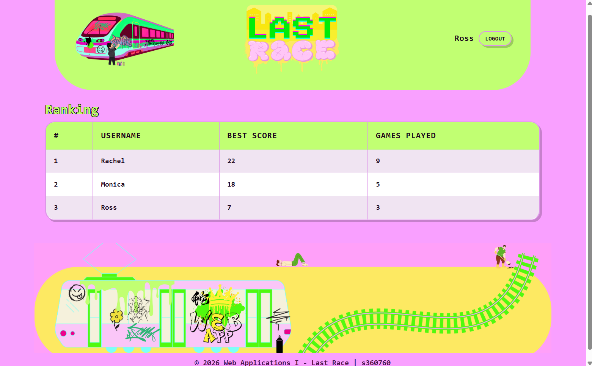
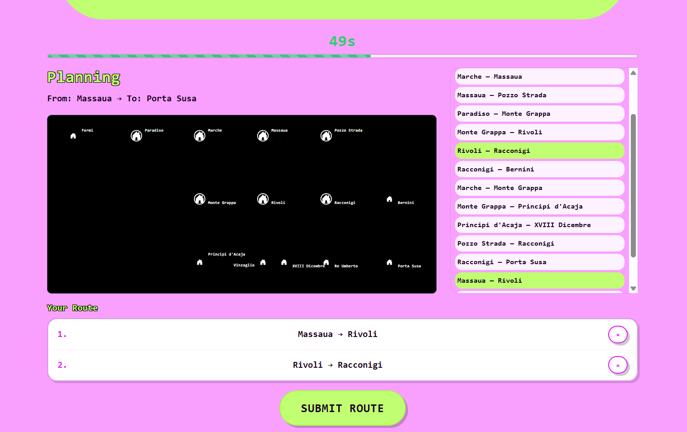
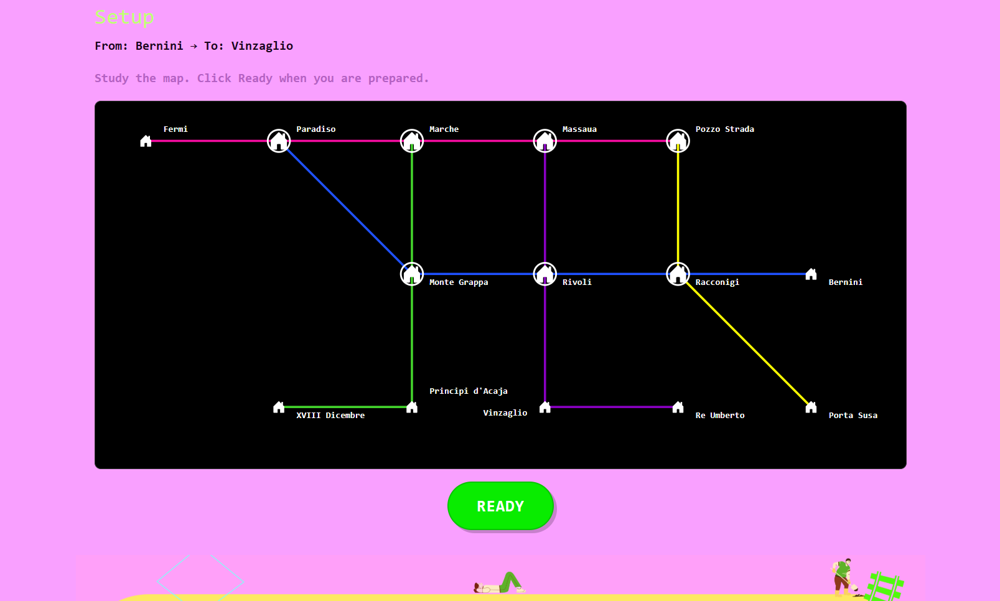

# Exam #1: "Last Race"
## Student: s360760 AKKAN BUSRA

## React Client Application Routes

- Route `/`: Home page for authenticated users. Shows "Play" and "Ranking" buttons. Redirects anonymous users to `/instructions`.
- Route `/instructions`: Public instructions page, accessible to all users. Accordion layout (How to Play / Rules). No network map shown.
- Route `/login`: Login form. Redirects already-authenticated users to `/`.
- Route `/play`: Full game page (authenticated only). Coordinates Setup → Planning → Execution → Result phases. Redirects anonymous users to `/instructions`.
- Route `/ranking`: Ranking page (authenticated only). Displays best scores and games played per user. Redirects anonymous users to `/instructions`.

## API Server

- POST `/api/sessions`
  - Request body: `{ username, password }`
  - Response: `{ id, username }` + session cookie (201). 401 on failure.

- DELETE `/api/sessions/current`
  - No body.
  - Response: empty (session destroyed).

- GET `/api/sessions/current`
  - No parameters.
  - Response: `{ id, username }` if authenticated, 401 if not.

- GET `/api/network`
  - Auth required. No parameters.
  - Response: full network object with lines, stations, and segments (includes line info). Used in Setup phase.

- GET `/api/network/segments`
  - Auth required. No parameters.
  - Response: list of segment pairs without line info. Used in Planning phase.

- POST `/api/games`
  - Auth required. No body.
  - Response: `{ id, startingStation, destinationStation, minDistance }`. Server picks a random valid pair with BFS distance ≥ 3.

- POST `/api/games/:id/start`
  - Auth required. No body.
  - Response: `{ success: true }`. Records planning start timestamp when player clicks "Ready".

- POST `/api/games/:id/route`
  - Auth required. Request body: `{ segmentIds: [number, ...] }`.
  - Response: `{ valid, score, steps }` for a valid route; `{ valid: false, score: 0, message }` for an invalid one.

- GET `/api/ranking`
  - Auth required. No parameters.
  - Response: list of `{ rank, username, bestScore, gamesPlayed }` sorted by best score.

## Database Tables

- Table `users` - Registered users. Columns: `id`, `username`, `password_hash`, `salt`, `created_at`.
- Table `lines` - Underground network lines. Columns: `id`, `name`, `color`.
- Table `stations` - Network stations. Columns: `id`, `name`.
- Table `line_stations` - Maps stations to lines with ordering. Columns: `id`, `line_id`, `station_id`, `position`. Used to detect interchange stations.
- Table `segments` - Adjacent station pairs per line. Columns: `id`, `station1_id`, `station2_id`, `line_id`.
- Table `events` - Random events with coin effects. Columns: `id`, `description`, `effect` (−4 to +4).
- Table `games` - One game session per play. Columns: `id`, `user_id`, `status`, `starting_station_id`, `destination_station_id`, `coins`, `score`, `created_at`, `planning_started_at`, `submitted_at`, `completed_at`.
- Table `game_route_segments` - Player's submitted route in order. Columns: `id`, `game_id`, `segment_id`, `line_id`, `position`.
- Table `game_step_events` - Events assigned per execution step. Columns: `id`, `game_id`, `segment_position`, `event_id`, `coins_before`, `coins_after`.

## Main React Components

- `App` (in `App.jsx`): Root component. Owns auth state, provides `AuthContext`, defines all routes and auth guards.
- `Header` (in `Header.jsx`): Banner. Login button for anonymous users, username and logout for authenticated users.
- `Home` (in `Home.jsx`): Landing page for authenticated users with "Play" and "Ranking" buttons.
- `LoginPage` (in `Login.jsx`): Controlled login form. Calls the login API and propagates the authenticated user up via props.
- `InstructionsPage` (in `Instructions.jsx`): Public instructions page with accordion (How to Play / Rules).
- `Game` (in `Game.jsx`): Phase coordinator. Uses `useGame` hook to render the correct phase UI (Setup / Planning / Execution / Result).
- `NetworkMap` (in `Map.jsx`): SVG map of the full network with colored lines, interchange markers, and station labels.
- `StationsOnlyMap` (in `StationsOnlyMap.jsx`): Planning phase SVG map showing station markers and names only, no line connections.
- `Timer` (in `Timer.jsx`): 90-second countdown with color coded progress bar. Calls `onTimeout`when time expires.
- `SegmentPicker` (in `SegmentPicker.jsx`): Scrollable list of segment pairs. Highlights selected segments, prevents reselection.
- `RouteBuilder` (in `RouteBuilder.jsx`): Ordered list of the player's built route with a remove button per segment.
- `StepDisplay` (in `StepDisplay.jsx`): Execution-step card showing the random event and coin effect.
- `Ranking` (in `Ranking.jsx`): Fetches `/api/ranking` on mount and renders the leaderboard table.

## Screenshot

## Users Credentials

| Username | Password          | Games Played |
|----------|-------------------|-------------|
| Rachel   | password_rachel   | 2 (scores: 22, 14) |
| Monica   | password_monica   | 1 (scores: 18) |
| Ross     | password_ross     | 0 |

## Use of AI Tools

AI (Claude, Gemini) assisted with project structure and certain logic (BFS), debugging, implementation of parts, refactoring logic and code quality review. Design choices were made by me, taking course labs as reference. I reviewed and manually tested before commits (manual `curl`-based API testing of every endpoint + end-to-end testing)